# Additional resources
- [tutoriat Matoka](https://github.com/Matoka26/OS_Tutoring_Materials/tree/main)
- [tutorial Mihai](https://sirbuig.github.io/operating-systems/)

# Overview
## Introduction

## Operating-System Structures

# Processes and threads
## Processes
- A **process** is a program in execution: it is an active entity, unlike the program code that is passive
- A job is a synonym for process and is mostly use due to tradition
- The program counter is a variable that points to the next instruction to execute in the current process
- The status of the current activity of a process is represented by the value of the program counter and the contents of the processor’s registers
- Process memory layout:
  - **Text section**: the executable code
  - **Data section**: global variables (initialised data (block started by symbol - bss), uninitialised data)
  - **Heap section**: memory that is dynamically allocated during program runtime
  - **Stack section**: temporary data storage when invoking functions (such as function parameters, return addresses, and local variables)
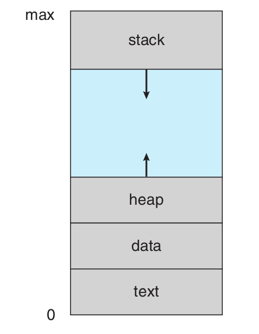
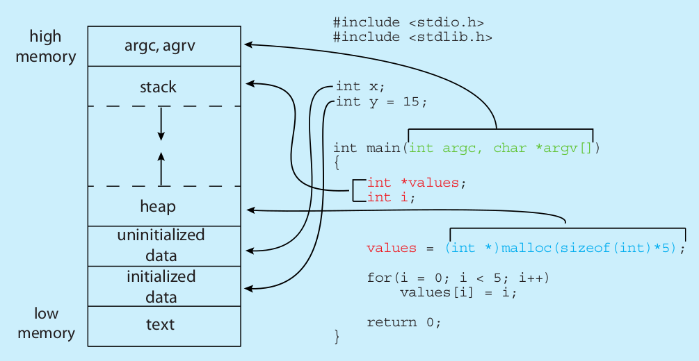
- A **process control block** (PCB) is the kernel data structure that represents a process in an operating system; it consists of its state, program counter, CPU registers, memory management information, CPU scheduling information, accounting information, I/O status information (opened files, allocated devices etc.); it resides in different parts of the OS depending on its state
- Process states:
  - **New**. The process is being created. PCB is added into the process table
  - **Running**. Instructions are being executed. PCB is stored in memory
  - **Waiting**. The process is waiting for some event to occur (such as an I/O completion or reception of a signal). PCB is stored in the wating queue
  - **Ready**. The process is waiting to be assigned to a processor. PCB is stored in the ready queue
  - **Terminated**. The process has finished execution.
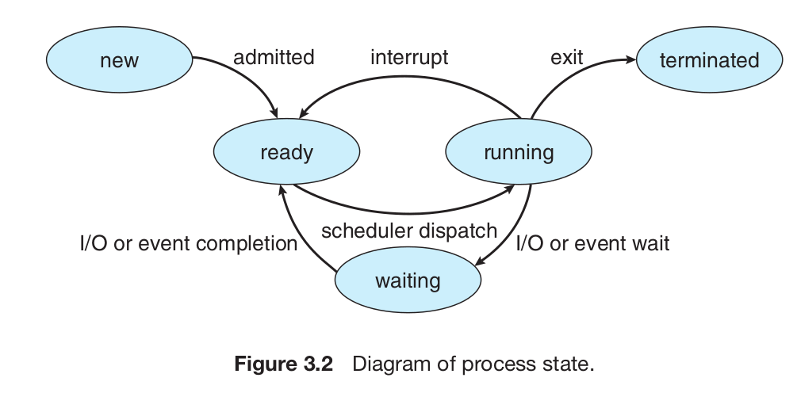
- From the PCB, all that is moved on the CPU when a process runs are just the registers and program counter; the rest is just for execution configuration
- The context of a process consists of PCB (storing state) and its registers (active state)
- The role of the process scheduler is to select an available process to run on a CPU.
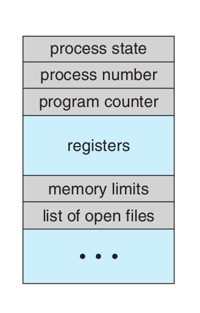
- A process can have multiple threads and, thus execute instructions in parallel
- Each CPU core can run one process at a time and that one is chosen by the **process scheduler**
- The number of processes currently in memory is known as the **degree of multiprogramming**
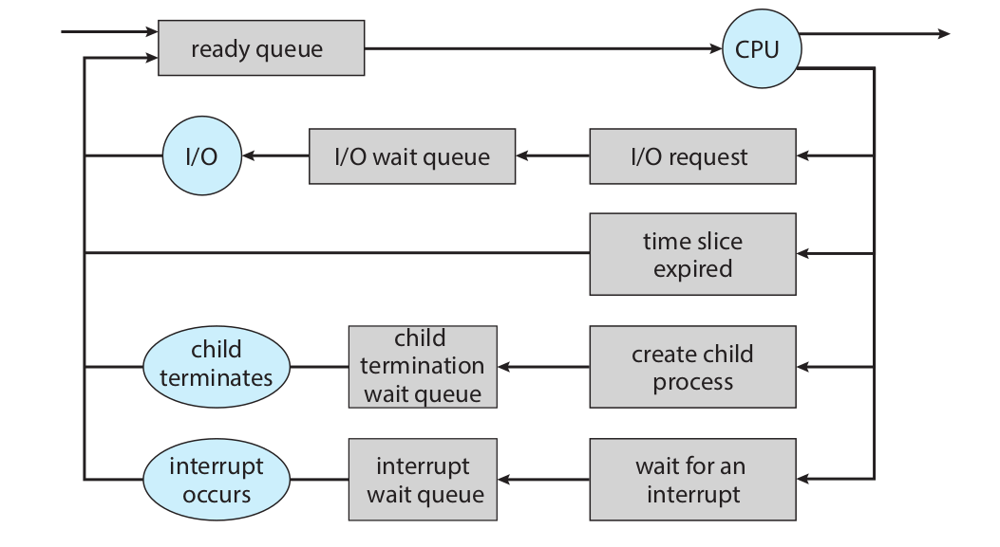
- **Context switch** = state save + state restore + kernel-user modes
- A process can have children i.e. other processes with whom it doesn't share its stack and its heap, but only shared memory segments, code, file descriptors
- if the child process calls `exec()` in `fork()`, this changes the memory of the child process; thus the 2 processes are completely separate now, until the child terminates or the parent doesn't wait for its children anymore
- if the child process doesn't invoke `exec()` the 2 processes are concurrent
- Cascade termination refers to the termination of children when the parent exits
- `pid = wait(&status);`
- if the parent didn't call `wait()` yet, its children are called **zombies**
- if the parent exited before children termination, those children are called **orphans**; in UNIX this is prevented by assigning the orphans to the `init` process that periodically calls `wait()`
- Independent and cooperating processes
- 2 main interprocess communication means: **shared memory** and **message passing**
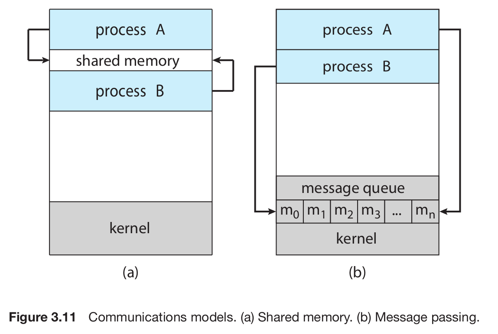
- Message passing is useful for exchanging smaller amounts of data, because no conflicts need be avoided.
- Shared memory can be faster than message passing, since message-passing systems are typically implemented using system calls and thus require the more time-consuming task of kernel intervention
- A **producer** process produces information that is consumed by a **consumer** process.
```c
typedef struct {
    // props
} item;

item buffer[BUFFER_SIZE];
int in = 0;
int out = 0;

// producer code
item next_produced;
while (true) {
    /* produce an item in next_produced */
    while (((in + 1) % BUFFER_SIZE) == out); /* do nothing */
    buffer[in] = next_produced;
    in = (in + 1) % BUFFER_SIZE;
}

// consumer code
item next_consumed;
while (true) {
    while (in == out); /* do nothing */
    next_consumed = buffer[out];
    out = (out + 1) % BUFFER_SIZE;
    /* consume the item in next_consumed */
}
```

- For message passing, a **communication link** must be established between the processes and the operations of `send()` and `receive()` must be defined
- There are some details to consider when implementing this:
  - Direct or indirect communication
  - sync or async communication (blocking or non-blocking)
  - automatic or explicit buffer
- Direct communication is good for simple cases, but in more complex instances is buggy and hard to maintained to implement due to hard-coding
- In indirect communication there is necessity for objects like **mailboxes** or **ports**
- Depending on the configuration, a communication link can be used in the communication between multiple pairs of processes
- **Mailboxes** can be owned by process or by the operating system
- The buffer size refers to the dimension of the buffer
  - Zero capacity (blocks immediately)
  - Bounded capacity (finite = n)
  - Unbounded capacity (infinite)
- when one needs to have only 2 processes to communicate then a simpler approach is to use **pipes**
- use cases: command line
- when implementing pipes, the following must be considered
  - bidirectional or unidirectional communication
  - half duplex of full duplex (data tranfer)
  - parent-child relation between the processes
  - communication can take place over a network or only on the same machine
- **Ordinary pipes**:
  - unidirectional (**reader end** and **writer end**)
  - require parent-child relation (each process has `int fd[2]`)
  - once a process terminates, the pipe ceases to exist
- **Named pipes** / **FIFO**s (in UNIX):
  - bidirectional
  - no relation between processes required
  - allows multiple processes to communicate with each others
  - UNIX: half-duplex (2 fifos for full-duplex)
  - Windows: full-duplex
  - UNIX: communication must reside on the same machine (sockets for cross-network communication)
  - Windows: can reside on different machines
- Two common forms of client–server communication are **sockets** and **remote procedure calls** (RPCs)
- **Sockets**
  - represent endpoints of communication
  - allow two processes on different machines to communicate over a network
  - they are a low level structure of communication and, thus, the bytes transfer is unstructured and the responsibility reside on the entities communicating
- **RPCs**
  - RPCs abstract the concept of function (procedure) calls in such a way that a function can be invoked on another process that may reside on a separate computer
  - the messages send between the participants are well structured
  - the communication consists of sending the function across the network to a listening **RPC daemon** that execute the function with the given parameters and returns the result as a request
  - the communication is achieved using a **stub** (for each remote procedure) on the client in which the procedure parameters reside and then sends (through message passing) them to the server with the remote procedure body; another stub on the receiver gets the data
  - in order to prevent issues of running a procedure multiple times or not executing it at all, 2 methods are implemented: **at most once** (timestamp on messages) and **exactly once** (**ACK** messages)

## Threads and concurrency
- A thread is a basic unit of CPU utilisation
- It consists of a thread ID, a program counter, a register set and a stack
- A **concurrent** system supports more than one task by allowing all the tasks to make progress. In contrast, a **parallel** system can perform more than one task simultaneously. Thus, it is possible to have concurrency without parallelism.
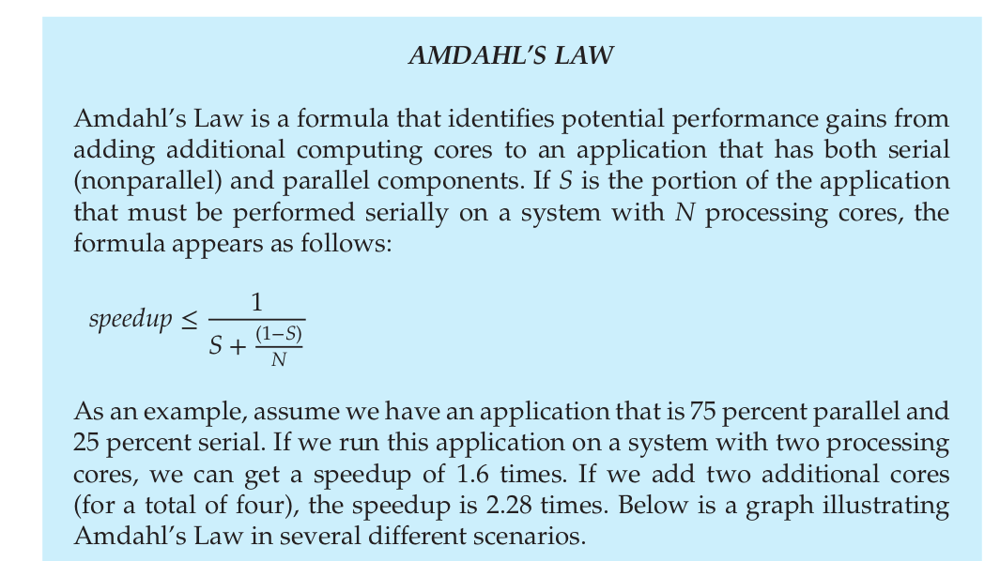
- **Data parallelism** focuses on distributing subsets of the same data across multiple computing cores and performing the same operation on each core (eg.: sum of an array)
- **Task parallelism** involves distributing not data but tasks (threads) across multiple computing cores. Each thread is performing a unique operation.
- User threads and kernel threads: many to one, one to many, many to many
- In the many to many relation there exists a data structure called **lightweight process (LWP)** (that are like some virtual processors) that is specific for each kernel thread; also, in this many-to-many case there exists a communication scheme between user threads and kernel threads through LWPs called **scheduler activation** (check the explanation - page 193)
- Asynchronous threading and synchronous threading
- Implicit threading means transfer the creation and management of threading from application developers, that identified the tasks that can be parallelised, to compilers and run-time libraries.
- 2 main types of implicit threading
  1. Thread pool (a group of threads created by the system ready to do a job)
  2. Fork join (create threads and wait for them to finish, recursion)
- `fork()` duplicate all threads if it doesn't consist of `exec()` command
- A signal is used in UNIX systems to notify a process (same process - synchronous, another process - asychronous (ctrl+C)) that a particular event has occurred (usually division by 0 or illegal memory access)
- ```kill(pid_t pid, int signal)```
- There are some situations when we want to cancel the execution of some threads (thus called **target threads**)
- There are 2 methods of cancelling threads:
  - Async cancellation: where one thread is responsible for cancelling the target threads (this can have negative impact in freeing all the using memory because it kills it forcefully)
  - Deferred cancellation: each process checks regularly if it should terminate; this is typically done by setting a special flag to `true`
- When a thread is set to cancel, the cancellation request is pending until the target thread reaches a **cancellation point** and that can be triggered by a variety of functions (`read()`, `write()` etc.)
- Besides this, between thread cancellation and thread termination, there exists a **cleanup handler** that frees the releases the thread resources
```c
// 1. Create and cancel a thread
pthread_t tid;
/* create the thread */
pthread_create(&tid, 0, worker, NULL);
// some code here
/* cancel the thread */
pthread_cancel(tid); // actual cancellation depends on how the target thread is set up to handle the request
/* wait for the thread to terminate: the time between cancellation request and cancellation point */
pthread_join(tid,NULL);


// 2. Deferred cancellation inside target thread
while (1) {
    // some work here
    /* check if there is a cancellation request: if it is, then it terminates, else it continues */
    pthread_testcancel();
}
```
- **Thread local storage** is the copy of the data of the current thread (similar to a static data unique for each thread)
- Linux doesn't distinguish between a process and a thread, relying on the `clone()` system call to create a task that can behave more like a process or more like a thread
- **Thread contention** occurs when multiple threads compete for shared resources (e.g., CPU, memory, locks, or I/O), leading to reduced performance and possible delays.

## CPU scheduling
- In a single core, only 1 process can run at some time
- Process execution consists of 2 states that are alternated: cycle on the CPU (**CPU burst**) and an I/O wait (**I/O burst**)
- CPU scheduler is the component that selects which processes to run on the CPU
- CPU is triggered in the following cases:
  1. the running process is set to the waiting state (give example)
  2. from running state to ready state (give example)
  3. from waiting state to ready state (give example)
  4. the running process terminates
- When only 1 and 4 conditions are considered by the scheduler i.e. there is no selection, the processes execute until they terminate or they enter the wait state, the scheduling scheme is called **nonpreemptive** or **cooperative**. Otherwise, it's called **preemptive**.
- The preemptive case, although more efficient for modern requirements and capabilities, is complex to implement and results in lots of **race conditions** between processes (inconsistent data shared between processes).
- The operating system needs to accept interrupts at almost all times. Otherwise, input might be lost or output overwritten. So that these sections of code are not accessed concurrently by several processes, they disable interrupts at entry and reenable interrupts at exit. It is important to note that sections of code that disable interrupts do not occur very often and typically contain few instructions.
- After the **CPU scheduler** selected a process, another component, called **dispatcher**, is responsible for actual preparations for the CPU core to run the chosen process by:
  - switching context
  - switching to user mode if needed
  - jumping to the proper location from the program in execution
- The time it takes the dispatcher to do all of that is called the **dispatch latency**
- Criterias in choosing a suitable scheduling algorithms are the following:
  - **CPU utilisation**: ideally between 40% and 90%
  - **Throughput**: the number of processes completed per time unit
  - **Turnaround time**: the time spent in the waiting queue, ready queue and executing (the interval until completion time)
  - **Waiting time**: the time in the ready queue
  - **Response time**: the time since the submission of the process until the first response
- Gantt chart is a bar chart that illustrates a particular schedule, including the start and finish times of each of the participating processes
- **First come first served (FCFS)**
  - this algorithm can generate a **convoy effect**
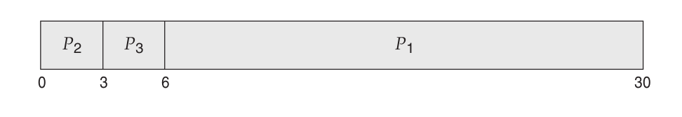
- **Shortest job first (SJF)**
  - minimum possible average waiting time
  - although optimal, it cannot be implemented since we cannot know the burst times of the processes prior to ordering
  - because of the efficiency it provides, we can solve the problem above by estimating the duration of the next burst based on the previous ones
  - typically, the next CPU burst is generally predicted as an **exponential average** of the previous bursts i.e. let $t_n$ be the CPU burst of the $n$-th CPU burst and let the $\tau_n$ be the predicted value for the process $n$; then $\tau_{n+1} = \alpha t_n + (1 - \alpha)\tau_n$; usually $\alpha$ is $1 / 2$
  - if we design the algorithm to be preemptive, then it could replace the current running process with a new one; thus it is also called **shortest remaining time first**
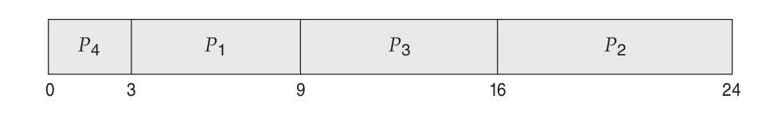
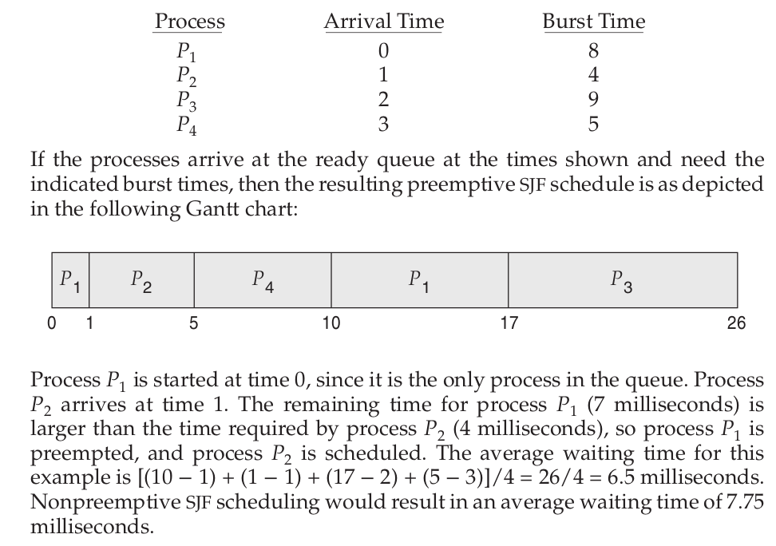
- **Round robin**
  - It is the same as FCFS, but it has defined a **time quantum** and iterates circularly between the processes letting them run as much time as the quantum allows
- **Priority scheduling**
  - The scheduler selects a process with the highest priority
  - A problem that rises by using these priority scheduling algorithms is the possibility for **indefinite blocking / starvation**
  - A solution to **starvation** is **ageing** that involves increasing the priority of a process throughout the time waiting in the queue
  - When there is a tie between the priorities, the **FCFS** and **Round Robin** can be used
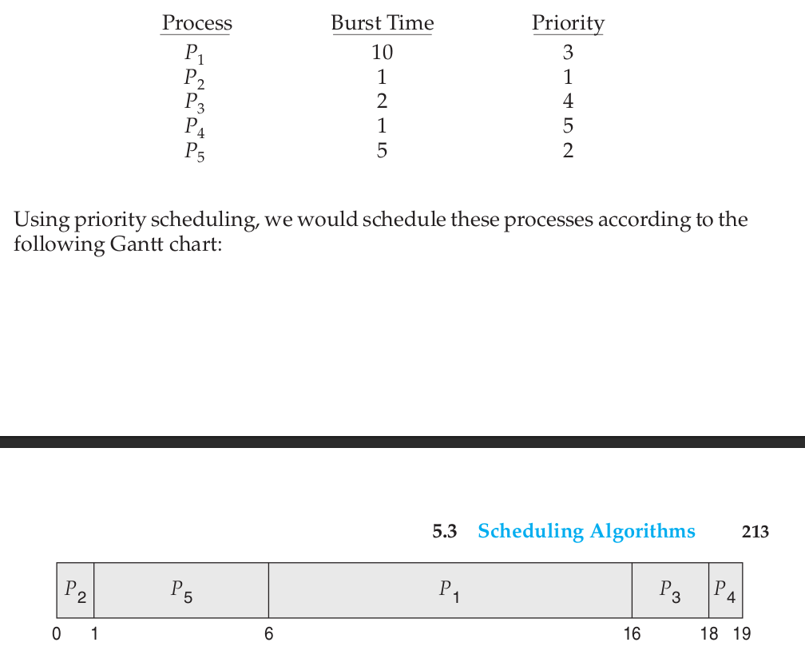
- **Multilevel queue scheduling**
  - It represents a priority scheduling with queues corresponding to each priority
  - Some common ways to categorise the processes and assign priorities are: real-time processes, system processes, interactive processes (foreground), batch processes (background)
  - Exploring this further, each priority queue can have its own algorithm for choosing the next processes and the interaction between the queues could be time sliced (80% for foreground queue and 20% for the rest)
- **Multilevel feedback queue scheduling**
  - One constraint of the multilevel queue scheduling is the inflexibility of procesess i.e. a processes cannot change the queue they are assigned firstly throughout their execution (they cannot change its nature)
  - A solution to that would be a set of queues that correspond to burst time of the processes i.e. the longer the burst time the lower the priority; also, to prevent starvation, ageing is applied for the longer processes (with lower priority)
  - In general this algorithm depends on the following parameters:
    - the number of queues
    - the scheduling algorithm for each queue
    - the method of ageing
    - the method of downgrading a process to a lower priority queue
    - the method to associate a queue to a process
- Regarding threads, the scheduling involves only kernel-threads; the user threads are managed by the threads library which then correlates them with some kernel-threads (through **LWP** or respecting the many to one model) that are the object of **CPU scheduling schemas**; this process of correlation is known as the **process contention scope** (competition for the CPU is only among threads of the same process)
- To decide which kernel-thread to run on the CPU, the kernel uses a **system contention scope** (competition for the CPU is between all the threads)
- **PCS** mechanism is done preemptively by considering the priorities of the user-threads (defined by the programmer)
- **Multiple processors scheduling**
  - **Asymmetric multiprocessing**: one core (the master server) handles all the scheduling decisions, I/O processing etc. and the rest serve only the user code; this can bring performance issues since the master can become a bottleneck
  - **Symetrical multiprocessing (SMP)**: one queue for all cores or each core with its queue
- In case of **SMP**, we need to make sure there is **load balancing** between the processors; this can be achieve in 2 ways:
  - **Push migrations**: a specific task looks for imbalances among cores (and, if it does, pushes threads from the high-working CPUs to the idle ones)
  - **Pull migrations**: in this approach, idle processors are the ones that pull threads from the overloaded ones
- Because moving a thread along the processors is expensive due to cache tranfer, the thread manifest a **processor affinity** i.e. it wants to stay on the same processor as much time as possible; explain processor affinity in **asymmetric multiprocessing**
- Soft affinity & hard affinity
- In NUMA (non-uniform memory access) architectures, there is a tension between **load balancing** and minimising **memory access time**
- **Heterogenous multiprocessing (HMP)** & **big.LITTLE**
- **Soft real time scheduling** vs **Hard real time scheduling** regarding critical processes
  - Latency: the difference in time between the moment when an event occurred and the time when it was served (ISR - interrupt service routine)
  - High priority based scheduling
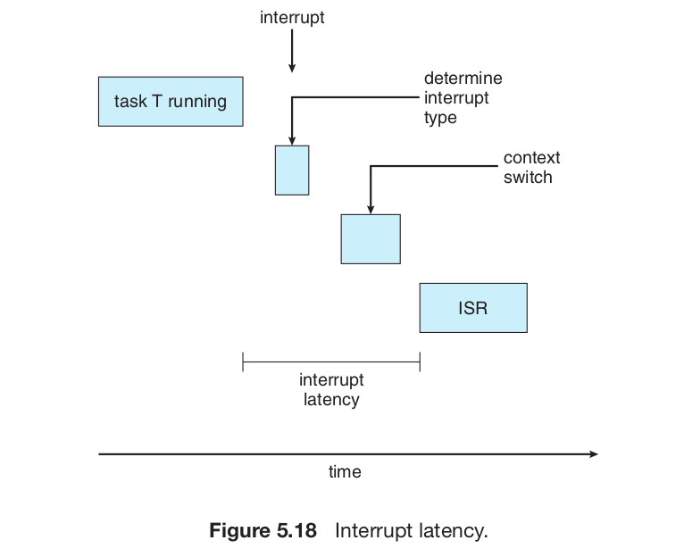
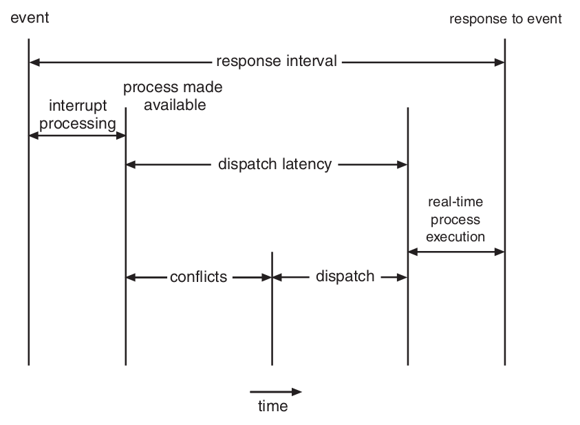
  - In real time scheduling, the processes are **periodic** and are defined by: fixed time to run the tasks (t), deadline to finish (d) and a period (p) ($0 \le t \le d \le p$); also the **rate** is defined as $r = 1 / p$
  - The above information states that each $p$ units of time, the process must be on the CPU $t$ units of time before deadline $n * d$
  - Given this information, the processor, using the **admission control**, unit either guarantees the completion of the process (it that case it admits it onto the CPU), or rejects it
- Algorithms for scheduling real time processes
  - **Rate monotonic scheduling (RMS)**: this is a real time scheduling algorithm that assigns each process a priority based on its rate; it is the optimal algorithm for scheduling, but it has a limitation in the use of CPUs (they could stay idle)
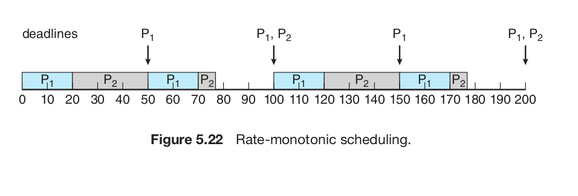
  - **Earliest deadline first (EDF)**: in this scheduling method, the priorities are set by the processors next deadlines (which can change throughout the tasks execution)
  - **Proportional shares**: it consists of assigning certain time shares of total running time to processes, assuring the application will have $N / T$ CPU time (where tf is the deadline tho??)
- $n = \lambda * W$, where $\lambda$ is the average arrival rate of new processes in the queue, $W$ is the average waiting time for processes, $n$ - the expected number of processes to be in the queue at some point in time


# Process syncronisation
## Syncronisation tools
- A **cooperating process** is a process that, cooperating with others to serve different functionalities, can be affected by other processes from the system
- A **race condition** occurs when 2 or more processes manipulate a certain value in the memory concurrently through an operation and, depending on the ordering of all the operations executed, we can get different results; besides this, the code location where the race condition can occur is called **critical section** (+ **enter section** + **remainder section** + **exit section** = program code)
- A solution to the **critical section problem** must satisfy the following requirements:
  - **Mutual exclusion**
  - **Progress**: the selection of the next process to enter the critical section cannot be postponed indefinitely; this can generate deadlocks
  - **Bounded waiting**: a process is guaranteed to enter the critical section after requesting that, after some bounded time; this can generate starvation
- **Peterson's solution**
```c
int turn;
bool flag[2];

while (true) {
  flag[i] = true;
  turn = j;
  while (flag[j] && turn == j);
  /* critical section */
  flag[i] = false;
}
```
- Due to the way compilers and computer architectures are designed it is possible that **Peterson's solution** cannot be implemented since those instruction are independent and their order could be changed by the executing unit
- To mediate this issue, there were created some hardware instructions in order to provide support for them:
  - **Memory barriers**
    - the way computer architecture guarantees what memory to provide to an application is based on its **memory model**, that can be **strongly ordered** or **weakly ordered**
    - in order to assure propagation of memory between CPUs, the computer architectures provide certain instructions that force that, called **memory barriers / fances**
  - **Hardware instructions**:
```c
// test and set
bool test_and_set(bool *target) {
  bool ret_val = target;
  *target = true;
  return ret_val;
}
while (true) {
  while (test_and_set(&lock));
  /* critical section */
  lock = false;
}

// compare and swap - no bounded waiting tho
int compare_and_swap(int *value, int expected, int new_value) {
  int temp = *value;
  if (*value == expected) {
    *value = new_value;
  }
  return temp;
}

bool waiting[n];
int lock;

while (true) {
  waiting[i] = true;
  key = 1;
  while (waiting[i] && key == 1) {
    key = compare_and_swap(&lock,0,1);
  }
  waiting[i] = false;
  /* critical section */
  j = (i + 1) % n;
  while ((j != i) && !waiting[j]) {
    j = (j + 1) % n;
  }
  if (j == i)
    lock = 0;
  else
    waiting[j] = false;
}
```
  - **Atomic variables**: use a similar logic to `compare_and_swap()` (**CAS**) to update a variable atomically
- **Mutex locks** solve the critical section problem by providing 2 functions, `acquire()` and `release()` that set the flag `available` to mark if the critical section is free or not
- A big disadvantage of mutex locks is the **busy waiting** of the processes (marked by that `while` loop) that, once they are placed on the CPUs, they do nothing significantly; thus, these locks are also called **spinlocks**
- A **semaphore** is a solution to the **critical section** problem that consists of a variable `S` and 2 functions `wait()` - this decreases the semaphore value and blocks if the values reaches $0$ or below, and `signal()` - increases the semaphore value (wakes up a waiting thread if any)
- this mechanism allows a specific resource to be accessed by no more then `S` tasks; thus, it is a generalisation for the mutex lock and, under the hood, it consists of a list of processes that represents the waiting list
- The advantage of the **semaphore** is that it is not a victim of busy waiting, since, when the process is waiting, it's moved to the waiting queue
- Even though the **semaphores** and **mutex locks** are powerful, they don't solve the issue when 2 processes do certain instruction (enter section instructions) in perfect timing or the issues related to programmer's bugs in terms of proper placing of functions
- A **monitor** is a high-level synchronization construct that encapsulates shared resources along with the synchronization mechanism (mutex + condition variables). Only one thread can execute inside the monitor at a time.
- The main components of a monitor are **mutual exclusion** and **condition variables** (to make tasks wait)
- In order to tackle these issues, we can use a **monitor**, i.e. an **abstract data type** that consists of functions and local data that assures only one process executes at some time in the critical section through a different condition mechanisms
```c
#include <stdio.h>
#include <pthread.h>
#include <unistd.h>

#define BUFFER_SIZE 5  // Maximum buffer size

typedef struct {
    int buffer[BUFFER_SIZE]; // Shared buffer
    int count; // Number of items in buffer
    int in, out; // Pointers for insertion and removal

    pthread_mutex_t mutex; // Monitor lock
    pthread_cond_t not_empty; // Condition variable for consumer
    pthread_cond_t not_full;  // Condition variable for producer
} Monitor;

Monitor monitor = {
    .count = 0,
    .in = 0,
    .out = 0,
    .mutex = PTHREAD_MUTEX_INITIALIZER,
    .not_empty = PTHREAD_COND_INITIALIZER,
    .not_full = PTHREAD_COND_INITIALIZER
};

// Producer function
void* producer(void* arg) {
    for (int i = 1; i <= 10; i++) {
        pthread_mutex_lock(&monitor.mutex); // Enter monitor

        while (monitor.count == BUFFER_SIZE) {
            // Buffer is full, wait
            pthread_cond_wait(&monitor.not_full, &monitor.mutex);
        }

        // Add item to buffer
        monitor.buffer[monitor.in] = i;
        printf("Produced: %d\n", i);
        monitor.in = (monitor.in + 1) % BUFFER_SIZE;
        monitor.count++;

        pthread_cond_signal(&monitor.not_empty); // Signal consumer
        pthread_mutex_unlock(&monitor.mutex); // Exit monitor

        sleep(1); // Simulate production delay
    }
    return NULL;
}

// Consumer function
void* consumer(void* arg) {
    for (int i = 1; i <= 10; i++) {
        pthread_mutex_lock(&monitor.mutex); // Enter monitor

        while (monitor.count == 0) {
            // Buffer is empty, wait
            pthread_cond_wait(&monitor.not_empty, &monitor.mutex);
        }

        // Remove item from buffer
        int item = monitor.buffer[monitor.out];
        printf("Consumed: %d\n", item);
        monitor.out = (monitor.out + 1) % BUFFER_SIZE;
        monitor.count--;

        pthread_cond_signal(&monitor.not_full); // Signal producer
        pthread_mutex_unlock(&monitor.mutex); // Exit monitor

        sleep(2); // Simulate consumption delay
    }
    return NULL;
}

int main() {
    pthread_t prod, cons;

    // Create producer and consumer threads
    pthread_create(&prod, NULL, producer, NULL);
    pthread_create(&cons, NULL, consumer, NULL);

    // Wait for threads to finish
    pthread_join(prod, NULL);
    pthread_join(cons, NULL);

    return 0;
}
```
- **Liveness failure** are a type mismanagement where the processes that must be synchronised could wait indefinitely (progress and bound waiting requirements are not respected); the most common causes for that are:
  - **Deadlocks**
    - this occurs when the processes are waiting indefinitely for an event to take place (in the context of semaphores is `signal()`)
    - every process in the set is waiting for an event that can be caused only by another process in the set
  - **Priority inversions**
    - It occurs when a higher-priority process depends on a lower priority one in order to be able to access its **critical section** or any other kernel data; in a preemptive kernel it is especially cumbersome
    - This is usually solved by implementing a **priority inheritance protocol** (priority increases as much time as needed) (reiterate L < M < H example)

## Syncronisation examples
- **The bounded buffer problem** (check the producer - consumer problem)
```c
// usually they consist of the following global structure
int n;
semaphore mutex = 1;
semaphore empty = n;
semaphore full = 0
```
- **The readers and writers problem**
  - Context: Suppose that a database is to be shared among several concurrent processes. Some of these processes may want only to read the database, whereas others may want to update (that is, read and write) the database. Obviously, if two readers access the shared data simultaneously, no adverse effects will result. However, if a writer and some other process (either a reader or a writer) access the database simultaneously, chaos may ensue.
- **The philosophers problem**
- A cross discipline solution to handle syncronization problems, that comes from database theory, is the **transactional memory**; here, the software or hardware (through **Software / hardware transactional memory (STM / HTM)**) assures the developer the operations are completed atomically, thus facilitating the programming process and debugging

## Deadlocks (optional, actually)
- Each thread needs to access certain resources (which are typically mutexes, semaphores, locks etc.) from the system through the use of **request**, **use** and **release** operations
- **Livelock** is similar to a deadlock where the processes block each other and don't make progress, even though they still do some operations
- Conditions for deadlock:
  - mutual exclusion
  - no preemption
  - hold and wait
  - circular wait
- To analyse better the deadlocks, a graph $G = (V, E)$, where $V$ consists of $T$ - active threads set and $R$ - the resources, and an edge from $R_i$ to $T_j$ is a **assignment edge** and the reverse is a **request edge**
- Thus, we can state the following based on the structure of the graph:
  - No cycles means no deadlocks
  - If each resource type has exactly one instance, then a cycle implies that a deadlock has occurred.
  - If the cycle involves only a set of resource types, each of which has only a single instance, then a deadlock has occurred.
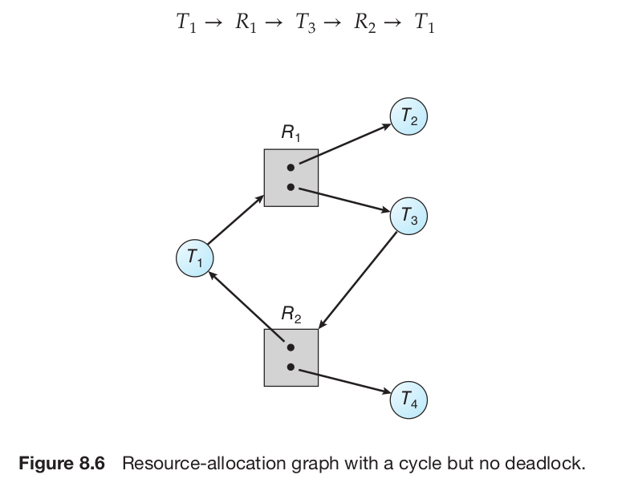
- The first 3 conditions for deadlock to occur are hard to tackle, but the fourth one can be prevented by assigning a injective weight function to each resource such that no process can acquire it if, at the same time, it has acquired a resource with a bigger weight - it must release it the acquire the other
- **Deadlock avoidance algorithms**
  - A sequence of threads $(T_1, T_2, ..., T_n)$ is a safe sequence for the current allocation state if, for each $T_i$, the resource requests that $T_i$ can still make can be satisfied by the currently available resources plus the resources held by all $T_j$, with $j < i$
  - **Safe state** (to be understood)
  - **Resources allocation graph**
    - besides the above definitions, we introduce the **claim edge** that is an edge between from $T_i$ to $R_j$ and means the thread i wants to access the resource j at some time in the future
    - with this algorithm, we want to integrate the claim edges (this is done by adding the reversed edge) such that there is no cycle in the graph
    - the disadvantage of this method is that we can apply it only when each resource has exactly 1 instance
  - **Banker's algorithm**
    - **Safety algorithm**
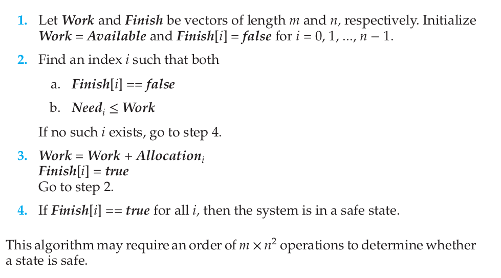
    - **Resource request algorithm**
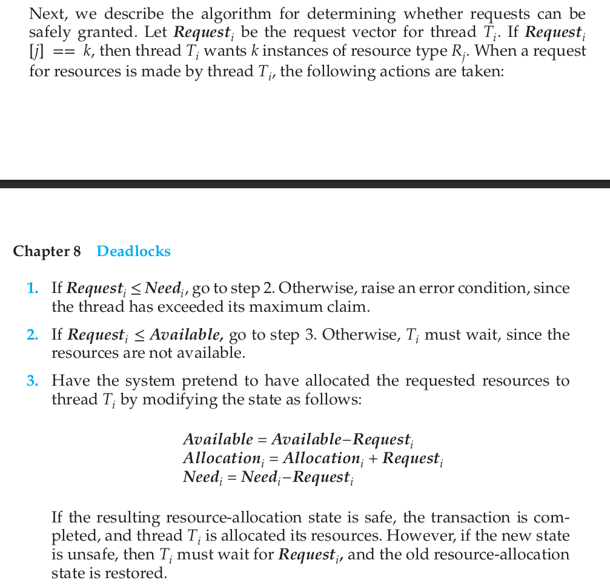
- **Deadlock detection** (to be studied)
- **Recovery from deadlock** (to be studied)


# Memory management

## Main memory
- The processes need to load data from somewhere in order to execute properly; we could store that data in PCB, but those would be huge; so we should have a special place where to store that data and, also, to access it rapidly - the main memory;
- The **cache** is added to the CPUs in order to prevent the processors to reach the **stall** state, thus improving the access speed
- We are also interested in the correctness of the operation the processors do and their permissions (user processes shouldn't access other user processes or the kernel processes); because the performance penalties would be terrible if these checks between CPU and memory would be implemented in software, they are implemented in hardware as follows: each process has a certain memory for itself and cannot access what is beyond it by bounding it with a **limit** and a **base register / relocation register**
- Address binding can happen anytime from **compile time** to **load time** (both are **physical addresses**) and **execution time** (**virtual address**) (present more details)
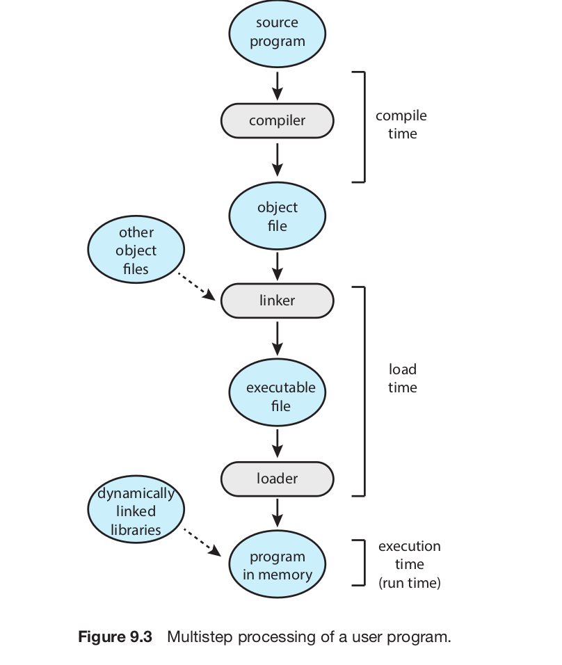
- An address generated by the CPU (in the heap of the process) is commonly referred to as a **logical / virtual address**, whereas an address seen by the memory unit - that is, the one loaded into the **memory-address register** of the memory - is commonly referred to as a **physical address**.
- The run-time mapping from virtual to physical addresses is done by a hardware device called the **memory-management unit (MMU)**
- In order to prevent excessive memory load by programs infrequently used, we can use **dynamic loading** to load into the process memory some routines specified by the programmer
- The memory is usually divided into 2 partitions: the operating system and the user processes
- Commonly, the operating system is placed in the higher addresses of it
- The user processes respect the **contiguous memory allocation**, being situated in a variable-sized location one after another; intially that memory is empty (a **hole**), but throughout time it can become an alternation of processes and holes
- When the memory doesn't have enough space for a process it can reject it and throw some error or add it in a waiting list
- The functionality of allocating processes considering holes in memory and processes size is a particular case of **dynamic storage-allocation problem**
- Strategies: **first fit**, **best fit**, **worst fit**
- The 2 strategies above suffer from **external fragmentation** (a lot of small holes throughout the memory)
- **First fit** results in **50 percent rule**
- **Internal fragmentation** occurs when the operating system decides to allocate the memory for processes in blocks and represents the surplus of such a block for a process (unused memory that is internal to a partition)
- **Compaction** is the procedure of separating the holes and the processes in the memory and represents a solution to the **fragmentation problem**; though, it is pretty expensive and it works only when the processes are relocated dynamically at the execution time
- Another solution to fragmentation is **paging**, that states the memory allocation shouldn't be contiguous due to the difficulty in relocation management
- The basic method for implementing **paging** involves breaking physical memory into fixed-sized blocks called **frames** and breaking logical memory into blocks of the same size called **pages**; from this point each page corresponds to a frame
- The storing sources for pages are the file system or the backstore; from there they are loaded into any available memory frames
- Every address generated by the CPU (virtual address) has a **page number** and a **page offset**
- The page number is converted by the **page table** in a certain frame and, by applying the offset to that frame we get the exact memory address of the process; the **page table** is a per-process data structure
- Similarly, the information about the frames (availability, free space, page allocation etc.) is stored in the **frame table**
- In order to preserve the page table information between processes and not to affect the context switch time, a special register called **page table base register (PTBR)** is used; it references the actual page table from the memory
- **Translation look-aside buffer (TLB)** is a data structures of keys / tags and values (entries) that stores page table addresses (pairs or page numbers and frame numbers) in order to speed up the paging (is similar to what cache does, but for the MMU)
- When the TLB is full, various replacement techniques are used (for entries not **wired down** i.e. fixed): LRU, random, round-robin
- The percentage of times that the page number of interest is found in the TLB is called the **hit ratio** & **effective memory access time**
- Pages with **reentrant code** (code that doesn't change, read only) could be shared to improve memory allocation
- Page table structuring:
  - **Hierarchical paging**: page table consists of pages of pages of ... of pages of offsets (multilevel hierarchy of paging) that are tranformed to a frame
  - **Valid-invalid bit**: used for pages protection or location of the corresponding pages (main memory or secondary memory)
  - **Hashed page tables**: a hash table of virtual addresses as keys and linked lists of page frames as values
  - **Inverted page table**: a global page table that stores the frame for each process represented by the `pid`
- If the total memory of the processes is greater than the main memory then we need **swapping** certain frames in the **backing store** (disk); in the modern operating systems swapping is accompanied by paging
- **Swap space** is a dedicated portion of disk storage used by the OS to store pages that cannot fit in RAM.
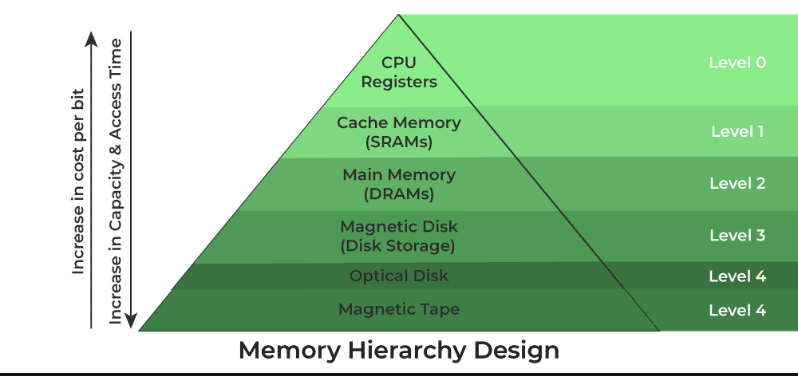

## Virtual memory
- **Virtual memory** address the issue of limited physical memory in the context of processes execution, since all the process memory should be in the physical memory in order to be executed, even though the process memory could be unused or too big. Virtual memory solves this issue by simply abstracting the logical memory of the processes such that the developer no longer needs to take care of how much physical memory is available and the processes just referring to their local heap memory
- The **virtual address space** is the address of a process in the virtual memory
- **Demand paging** is a lazy technique for virtual memory that allocate the memory frame only when needed; to implement that we need to have a specific page table that allows us to retrieve the specific memory frames and the best way to represent that is with a valid-invalid bit page table such that when a page is in secondary memory (**page fault**) or the process is forbidden to access it the bit is set to invalid
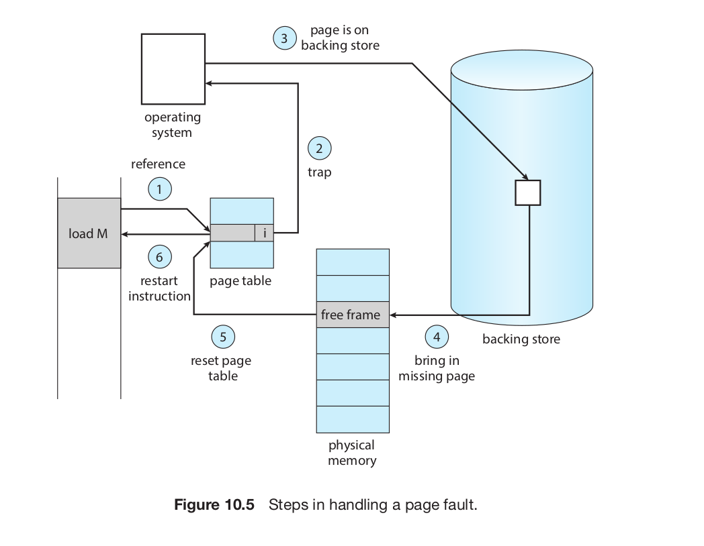
- A major drawback of the **demand paging** is that some instructions can fail to execute completely because of some page faults and, thus, progress is lost since the instruction must be restarted; 2 common ways of solving this issue involve assuring all pages are in memory prior executing the instruction or making sure to save the state before page fault occurred; but the problem with them is that are difficult to implement without affecting the overall performance
- To mark which frames are available, the main memory has a **free frames list** (linked list of free frames) that are allocated by the operating system after zeroing them out (for security reasons)
- In some scenarios demand paging can be unnecessary; for example, when creating child processes we just need to copy the parent process address space and add it into the memory
- Though, in many cases the child process run `exec()` command within its code, resulting in a useless parent address space
- To mitigate this issue, we can use a technique called **copy on write** that allows the parent and the child to initially share the same pages; thus, when the child process attends to modify it, a copy will be created and the modification will occur, but only on that specific page
- When a page fault occurs, the operating system couldn't find the frame in the free frame list, so it needs to look for it in the secondary memory; due to swapping is a pretty slow procedure, majority of operating systems combine it with **page replacement**
- **Page replacement** mainly consists of finding a **victim page** in the free frame list and moving it in the secondary memory
- To speed up the process (in the worst case, it should be 2 operations with the secondary memory - 1 page in and 1 page out), a **dirty /modify bit** embedded in hardware is used to mark if the page was modified
- Thus, given the above procedures, we must solve two major problems to implement demand paging: we must develop a **frame-allocation algorithm** (how many frames are allocated to each process) and a **page-replacement algorithm** (how to choose which frame is the victim)
- Besides these, the operating system has some special kernel routines (called **reapers**) that assure the physical memory occupation doesn't decrease or increase beyond a specific threshold; it reclaims memory or suspends memory reclaiming depeding on each case
- **Page replacement algorithms**
  - **FIFO page replacement**: the victim is the first page in the queue
  - **Optimal page replacement**: the optimal algorithm that consider the victim the page that won't be used in the longest period of time; difficult to implement since it requires future knowledge
  - **Least recently used**:
    - the victim is the oldest used page; 2 implementations: search with clocks and counters or stack with doubly linked list
    - hardware support is limited so various algorithms should be used to approximate it with lower hardware use
    - a minimalistic way hardware supports LRU is by handling a **reference bit** that is initially cleared (set to 0) and set automatically to 1 when the page is used
    - **Additional reference bits algorithm**: 8 bits to get the history of processes, snapshot every 100 ms
    - **Second chance algorithm**: the algorithm is similar to FIFO replacement but it considers the reference bit (if it's 1 is set to 0 and goes to the end of the queue)
    - **Enhance second change algorithm**: second chance algorithm + **modify bit**
  - **Counting based page replacement**
    - The least frequently used
    - The most frequently used
  - **Page buffering algoirthms and techniques**
    - A frame is moved to a buffer before secondary storage in order for the running process to start as soon as possible
    - When the paging device is idle it can update in the secondary memory one of the changed pages, thus adding a possible speed up to the future replacements (that considers the modify bit)
- **Allocations of frames**
  - **Minimum number of frames**
    - defined by the computer architecture
    - indirect access can provide more memory frames than the actual instruction
  - **Algorithms**
    - Proportional allocation (considering the size in the virtual memory and, probably, the process priority)
    - Equal allocation
  - **Global replacement**
    - it refers to the ability of some processes to steal the memory frames from other processes (possibly, with lower priority)
- When a process spends more time paging than executing (it didn't get the minimum number of frames and all the frames in the memory are owned by active processes, so they cannot be replaced since are needed right away) **thrashing** happens
- One way to solve **thrashing** is by using a **local replacement allocation** such that the processes are not allowed to steal frames from other processes; still, this doesn't solve the problem since the processes could spend a lot of time waiting for the paging device (thus increasing the degree of multiprogramming which lead to more paging device waiting)
- In order to tackle the problem above, we could analyse the **locality model** and see what pages are needed for some period of time; this is based on the fact that usually processes change the set of pages to use from time to time and keep it constant otherwise
- A solution that implements the above idea consists of having a **working set window** with a specific size based on which we compute the **working set** of pages that mostly corresponds to the current locality; in this way, when the total lengths of working sets exceeds the physical memory, the kernel suspends some processes, thus avoiding thrashing
- Another solution to the problem is a more direct approach: we want to minimize the page fault rate, so when a process has this rate above an upper bound we have to give it more frames; similarly for the lower bound
- **Memory compression**
- **Kernel memory allocation**
  - **Buddy system**
    - it involves dividing a contiguous memory location (segment) with the size power of 2 into subsegments also power of 2 until the needed space is satisfied (the nearest greater power of 2 page is chosen, possibly causing fragmentation)
  - **Slab allocation**
    - when a CPU or kernel subsystem does a request the **kernel allocation** is triggered and the **slab allocator** looks among the caches to find the demanded **kernel object**
    - each cache corresponds to a certain type of kernel objects (semaphores, process descriptors etc.)
    - each cache contains multiple slabs of pre-allocated objects and each slab corresponds to a page in the **slab memory**
    - slabs can be in 3 states: full, empty and partial
    - the slab allocator firstly looks for the demanded object in the **partial** slabs in order to reuse the objects; then checks the empty slabs
    - if there is no pre-allocated object in the cache, then it is allocated a new slab with the instance of an object and referenced by a simple pointer
    - for association, think of cache as page table, slabs as frames and kernel objects as data structures that the operating system needs and are initialised in the slabs
    - thus, we get no memory fragmentation and fast responsivity from the kernel because of objects reuse
- **Prepaging** involves bringing the pages into the memory before actually using it in order to prevent the page faults; it is the most potent if used together with the locality model
- Page size
  - Fragmentation argues for smaller page size
  - I/O operation argues for larger page size (from latency and seek)
  - Page fault ratio argues for larger page size
  - The tendancy is for larger page sizes, usually `4KB`
- **I/O interlock and page locking**

# File system
## File system interface (refactor)
- The operating system abstracts from the physical properties of its storage devices to define a logical storage unit, the **file**
- **Text files**, **source files**, **executable files**
- File attributes
  - name
  - identifier (unique tag to identify the file within the file system)
  - type
  - location (pointer to the location of the file on certain device)
  - size
  - protection (read, write, execute)
  - timestaps and user identification
- File operations
  - create a file: find space for file, directory must create an entry for the file
  - open a file
  - write a file: write pointer & **current-file-position pointer**
  - read a file: read pointer & **current-file-position pointer**
  - reposition within a file: The current-file-position pointer of the open file is repositioned to a given value; aka **seek**
  - delete a file: free the space allocated for this file if no **hard links** remain
  - truncating: delete its content, but the attributes are unchanged
- When a file is open, its information is stored in an **open-file table** so that no further constant search through the file system is needed; the `open()` operation typically returns a pointer to an entry in the open-file table
- An open file has some information associated with it throughout its existence:
  - file pointer (**current-file position pointer**)
  - file-open count
  - location of the file (actual location of the file: RAM, disk, server across the network etc.)
  - access rights (this information is stored in the **per-process table** that points to a **system-wide table** where process independent information about the file is stored)
- File locking between the files is similar to reader-writer locks, where **shared locks** are reader locks and **exclusive locks** are writer locks
- File extensions are hints for the users and applications
- Internal file structure consists of a sequence of physical blocks (usually 512 bytes) that are mapped over by logical records in a way similar to contiguous memory allocation and paging; thus, it results in internal fragmentation
- **File access methods**
  - **Sequential access**
    - information in a file is processed one record after another, sequentially
    - it cannot jump to random addresses
  - **Direct access**
    - the file is sparsed across the memory blocks (since the secondary memory allows random access to any block) and each block references the next one through a pointer
    - data can be accessed directly at any position (given the block and the offset) by using the **open-file table**
- A directory is a special file that stores entries for other files; each entry associates the file with its file control block through a pointer
- Directory operations
  - Search for a file
  - Create a file
  - Delete a file (& defragmentation)
  - List a directory
  - Rename a file
  - Traverse the file system (recursively)
- Types of structures
  - Single-level directory
  - Two-level directory: user file directory & master file directory
  - Tree-structured directories
    - 1 bit to differentiate between subdirectory and file
    - absolute and relative paths
    - current directory
  - Acyclic graph directories
    - in some situations there is need for cooperation between users within the same system
    - thus, the need for shared files rises in such a way that there is no duplication memory
    - besides this, due to different ways to structure own directories, users can create **links** to those specific files and move them around
    - some issues: deleting files with links pointing to them, multiple absolute addresses for a file, cycles
  - General graph directories
    - cycles (self cycles, normal cycles) and unreachable files are handled by the **garbage collection**
- In the context of files protection the following operations should be considered: read, write, append, execute, delete, list, attributes change
- One way to provide protection functionalities is by restricting the access control; this idea is implemented by providing an **access control list (ACL)** composed of: **owner**, **group**, **other / universe**
- `drwxrwxrwx`
- **Memory mapping** is a technique used in order to speed up the process of accessing files by allowing parts of the virtual address space to be associated with the file (brings the file in the process memory for buffering, syncronisation etc.; see the `mmap()` example from the labs)
- Quite often, shared memory is in fact implemented by memory mapping files
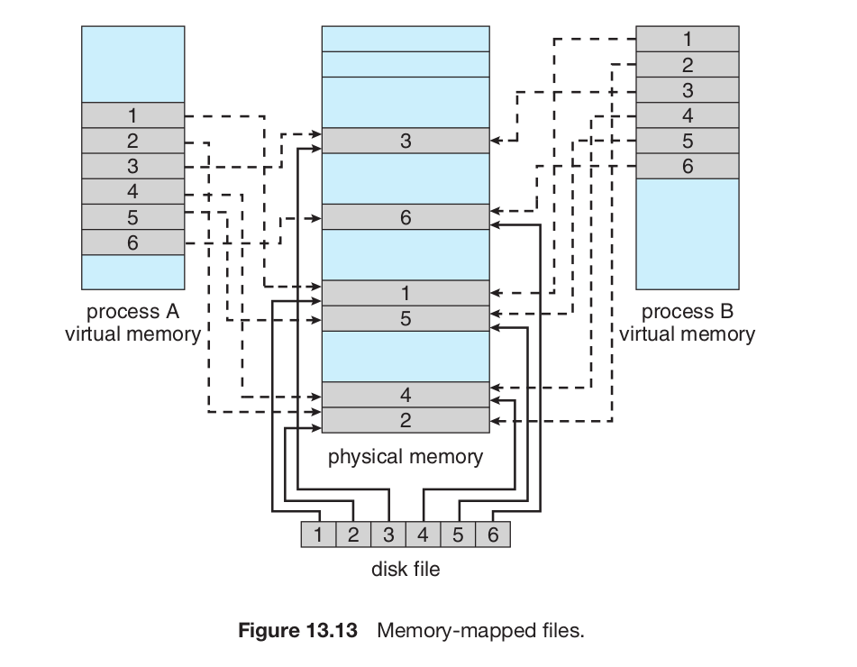

- **As a recap, the file system is related to the above presented functionalities as follows**:
  - Loading Executable Files into Memory
    - The OS reads the executable file from the file system.
    - The executable is mapped into the process's virtual address space. This is done using memory-mapped files (e.g., mmap system call).
      - The code segment (text) is mapped as read-only.
      - The data segment (initialized and uninitialized data) is mapped as read-write.
    - If the executable depends on shared libraries (e.g., .so files on Linux or .dll files on Windows), the OS loads these libraries into memory and maps them into the process's address space.
  - Accessing Files During Execution
    - A process calls open to access a file. The OS returns a file descriptor, which is an index into the process's file descriptor table.
    - The process uses read and write system calls to interact with the file. The OS handles the actual reading/writing from/to the file system.
    - Files can be mapped directly into the process's virtual address space using `mmap()`. This allows the process to access file data as if it were memory, simplifying I/O operations.
  - Virtual Memory and File System Interaction
    - When a process accesses a memory-mapped file or an executable's code/data, the OS loads only the required pages into RAM. If the page is not in RAM, a page fault occurs, and the OS fetches the page from the file system or swap space.
    - If physical memory is full, the OS swaps out less-used pages to disk (swap space) and swaps in required pages from the file system.
  - Process Isolation and File Access
    - Each process has its own virtual address space, ensuring isolation.
    - File access is controlled via permissions (e.g., read, write, execute) stored in the file system metadata.
    - The OS enforces these permissions when a process tries to access a file.


## File-system implementation
- File systems provide efficient and convenient access to the storage device by allowing data to be stored, located, and retrieved easily.
- Due to performance reasons (possibility for direct access and sequential processing), the file system is mainly stored on the disk, more exactly **non-volatile memory (NVM)**
- Transfers between the memory and mass storage is done in units of **blocks** consisting of sectors of `512 bytes` (HDD) or `4KB` (NVM)
- File system layered structure:
  - **The I/O control** level consists of device drivers and interrupt handlers to transfer information between the main memory and the disk system (it actually serves the upper layer commands)
  - The **basic file system** (called the "block I/O subsystem" in Linux) needs only to issue generic commands to the appropriate device driver to read and write blocks on the storage device (it does the commands and manages support for commands (buffers, scheduling etc.))
  - The **file-organization module** knows about files and their logical blocks (it provides the translations to physical memory for the logical blocks where the needed files reside)
  - the **logical file system** manages metadata information; it maintains the files structure via a **file-control block (inode in UNIX)** that it sends to the lower layers together with the management of directory structures so that it can find the logical addresses of needed blocks
  - at the top there are the **application programs** that want to access certain files
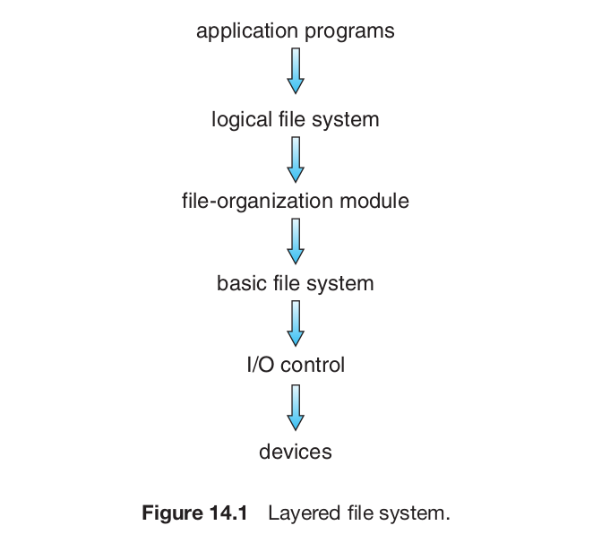
- Several on-storage and in-memory structures are used to implement a file system (equivalent to helpers and utils).
- On storage are the following:
  - **A boot control block** (per volume) can contain information needed by the system to boot an operating system from that volume
  - **A volume control block** (per volume) contains volume details
  - **A directory structure** (per file system) is used to organize the files
  - A per-file FCB contains many details about the file
- In-memory are the following:
  - An in-memory **mount table** contains information about each mounted volume.
  - An in-memory **directory-structure cache** holds the directory information of recently accessed directories.
  - The **system-wide open-file table** contains a copy of the FCB of each open file, as well as other information.
  - The **per-process open-file table** contains pointers to the appropriate entries in the **system-wide open-file table**, as well as other information, for all files the process has open.
  - Buffers hold **file-system blocks** when they are being read from or written to a file system.
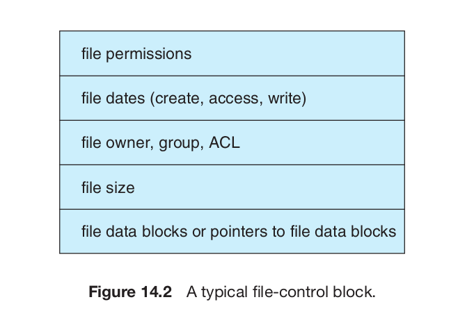
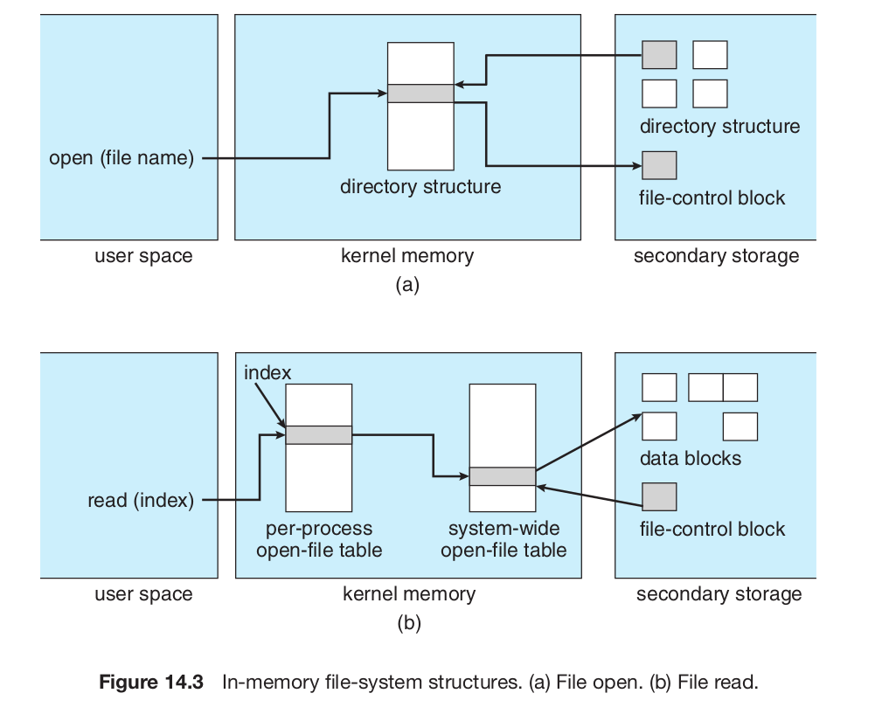
- **Directory implementation**
  - Besides the file system functionality layers and actual on-storage and in-memory structures, the other fundamental aspect of file-system implementation is the directory implementation
  - **Linear list**
    - the files are stored in memory as a list of file names together with the pointers to the memory blocks
  - **Hash table**
    - the directory is a hash table of file names and pointers to blocks
- **Allocation methods**
  - **Contiguous allocation**
    - the files are allocated one after another in the secondary memory facilitating the sequential and direct access methods
    - as usual, there are problems with external fragmentation
    - besides this, the files can grow throughout the time so, if we apply some algorithms for fragmentation (like best fit or first fit) the holes found could not be sufficient in the closed future; 2 ways to handle this is by copying the files to bigger holes when the space become insufficient or create an **extent** that points to another hole
  - **Linked allocation**
    - each file is a set of blocks arranged in a linked list
    - the directory entry needs to store only the first and the last pointers (to blocks) for each file
    - only the sequential access method is possible
    - besides this, from each block we need to decrease from its size the memory allocated for the address of the next block
    - one solution to the above problem are grouping the blocks into **clusters**
    - another problem is the reliability: what happens if one of the pointers is broken or a system bug occurs? some solutions would be to store more information in the blocks to make sure the next block is the suitable one (like file name or keeping a doubly linked list), but now the space for the actual file data is much more smaller
    - a similar method is achieved by using a **File allocation table (FAT)** which is simply an indexed list (indexed by the number of blocks) whose values are the next blocks of the files or an end-of-file value
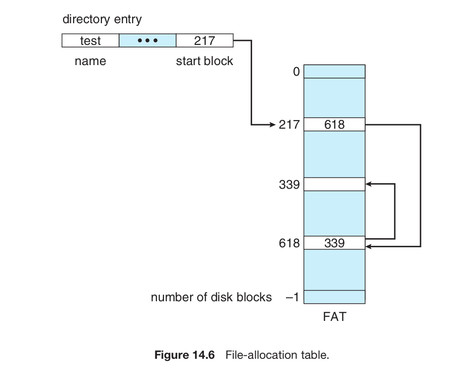
  - **Indexed allocation**
    - an indexed allocation consist of having an indexed table of blocks allocated for each file where the i-th element in the table is the i-th block of the file; the directory entry just stores a pointer to the indexed table
    - as we can see, it allows sequential access and direct access
    - though, a problem is choosing the size of the indexed table - a bigger one could mean significant memory waste and a smaller one could mean the necessity for more indexed tables so they will become more difficult to manage
    - solutions with more indexed tables could be:
      - **linked scheme**: the indexed table has on the last positions a pointer to another index table
      - **multilevel index**: the allocation contains of indexed tables with pointers to other indexed tables and so on until we reach the level where the actual file blocks reside (most suitable for big file sized eg.: 4 GB)
      - **combined scheme**: a combination of the above could be used: an indexed table of blocks and pointers to other (multilevel) indexed tables
- As we can see, some allocations provide only direct access and some both sequential and direct access; thus it is a good idea to know prior to file creation what methods we will use to access it in order to allocate the memory properly; also, a file can change its allocation type by copying into another file with the respective allocation
- The performance of indexed allocation depends on the index structure, on the size of the file, and on the position of the block desired
- **Free space management**
  - We know how to allocate memory efficiently; but how to get that memory efficiently?
  - To keep track of free disk space, the system maintains a **free-space list**
  - **Bit vector**
    - the free-space list is implemented as a vector of bits, where i-th bit is `0` means the i-th block is used and viceversa
    - though, the search is done in groups of bits for faster processing and stopping only when the number is non-`0`
  - **Linked list**
    - a linked list of free blocks; when needed more memory, usually the first block is allocated and moved to FAT
  - **Grouping**
    - divide all the blocks into clusters of $n$ where the first block points to the next $n - 1$ blocks, and the last block points to the next block of pointers to blocks
  - **Counting**
    - we make use of the fact that some processes may have contiguous memory allocated so, when freed, we will store the starting address and the count of free blocks after that
- Performance
  - **Buffer cache** and **page cache** in the main memory -> **double caching** on memory mapping if used separately
  - The **page cache** uses virtual memory techniques to cache file data as pages rather than as file-system-oriented blocks.
  - to prevent inconsisting caches, some operating systems use **unified buffer cache**
  - page caching can be improved by some particular page replacement algorithms like **free-behind** (removes a page as soon as it is processes - good for sequential access) and **read-ahead** (store the requested page and a few subsequent ones in the cache - good when assuming those blocks will be used again shortly)
- Recovery strategies
  - **Consistency checker**
  - **Log-structured file system** & atomic transactions
- **Restore and back-up**
  - The operating system periodically does **incremental back-ups** (copies the changes since the last back-up to a separate medium) and **full back-ups** (merge all the incremental back-ups)
  - The **restore** is based on the last **full back-up**
  - Since we can find out a corrupted file too late (after the full back-up finished) we need another strategy to store healthy files: **forever full back-up** & full separate storage