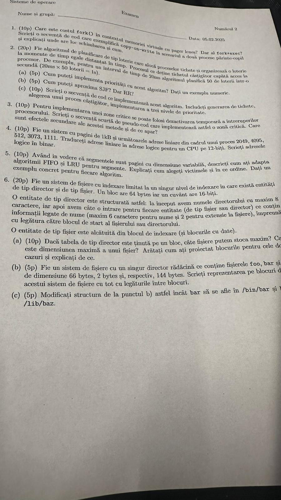

1. Ex1
- In contextul memoriei virtuale cu pager lenes (demand paging), costul unui `fork()` este determinat de timpul ca paginile procesului parinte sa fie copiate in memoria principala
- Pentru `fork()` + `exec()` costul va fi cel de mai sus impreuna cu timpul necesar incarcarii programului comenzii din `exec()` si a paginilor aferente
- In cazul in care se va implementa `copy-on-write` in memorie, atunci programul nu va copia procesul parinte in memorie de indata ce va fi creat copilul, deoarece estimeaza ca poate apela `exec()` si sa fie degeaba toata copierea; o secventa de cod este urmatoarea:
```c
int x = 5;

int main() {
    pid_t pid;

    pid = fork();
    if (pid == 0) {
        printf("Pana aici nu se copiaza nimic din parinte");
        x = 10; // de aici se copiaza heap-ul parintelui in memorie si se atribui procesului copil
    } else if (pid > 0) {
        x++;
    }
    return 0;
}
```

2. Ex2
- Prioritatile se pot implementa asa: cu cat prioritatea unui proces este mai mare, cu atat in dataset-ul cu tichete vor fi mai multe tichete egale cu cel al procesului respectiv.
- SJF se poate aproxima sortand procesele in functie de timp si, de fiecare data cand avem un proces nou in lista, umplem loteria doar cu tichetul lui si il scoatem cand CPU-ul il termina (termination state)
- RR-ul se poate aproxima eliminand tichetele proceselor deja procesate si, atunci cand nu mai avem tichete in set, le punem pe cele corespunzatoare proceselor inca meterminate si reluam procesul
- 